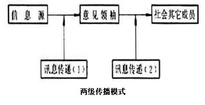
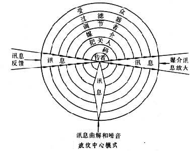

# 1.定义
> **信息流行病**指的是，在此次新冠肺炎疫情爆发期间，线上线下过多的信息——有些准确有些不准确，使得人们在有需要时难以找到可信赖的消息源和可靠的指导。**——百度百科**

&emsp;&emsp;**Infodemic**即**Informatics**（信息） + **Epidemic**（流行病），也称信息疫情。指在当前**互联网高度发达**的社会背景下，**重大公共安全事件**的发生往往导致**信息的爆炸式增长和病毒式传播**，由于缺乏有效的甄别机制，导致传播的信息内容往往**参差不齐**，$\color{red}{让人们难以分辨真正值得信任的信息}$，其中消极的、错误的、负面的信息往往容易对个体造成消极的影响。

# 2.数据源
+ 观测数据，现场获取的实测数据。
+ 统计调查数据，统计报表和社会调查数据等。
+ 新闻媒体发布数据
+ 网络用户分享数据
+ 口头传播数据

# 3.传播模式
>**传播模式是指研究传播过程、性质、效果的公式。**20世纪20年代以来，西方传播学研究中出现了反映不同观点和不同研究方法的多种模式，但没有一个被普遍接受的模式。早期多为单向线性模式，50年代以来普遍强调传播是双向循环过程。  ——百度百科

+ 具有**代表性**的传播模式：
    + 各模式传播过程图
        + “5W”模式
    ```{r img1,fig.cap='',out.width='70%',fig.align='left',echo=FALSE}
    
    knitr::include_graphics("images/5w.jpg")
    ```
        
        + 香农-韦弗模式  
    ```{r img2,fig.cap='',out.width='100%',fig.align='left',echo=FALSE}
    
    knitr::include_graphics("images/xiangnong.jpg")
    ```
        
        + 两级传播模式  
    ```{r img3,fig.cap='',out.width='80%',fig.align='left',echo=FALSE}
    
    
    ```       
        
        + 施拉姆模式  
    ```{r img4,fig.cap='',out.width='90%',fig.align='left',echo=FALSE}
    
    knitr::include_graphics("images/shilamu.jpg")
    ```       
    
        + 德弗勒模式  
    ```{r img5,fig.cap='',out.width='80%',fig.align='left',echo=FALSE}
    
    knitr::include_graphics("images/defule.jpg")
    ```       
        
        + 韦斯特利-麦克莱恩式  
    ```{r img6,fig.cap='',out.width='80%',fig.align='left',echo=FALSE}
    
    knitr::include_graphics("images/weisi.jpg")
    ```       
        
        + 波纹中心模式  
    ```{r img7,fig.cap='',out.width='80%',fig.align='left',echo=FALSE}
    
    
    ```       

    + 各模式简介与特点
```{R, echo=FALSE}
table1 <- data.frame(Type = c("“5W”模式","香农-韦弗模式","两级传播模式","施拉姆模式","德弗勒模式","韦斯特利-麦克莱恩式","波纹中心模式","一致性模式"), Introduction = c("将传播活动解释为由传播者、传播内容、传播渠道、传播对象和传播效果五个环节和要素构成","将人际传播过程看作单向的机械系统,模式中的“噪音”表明了传播过程的复杂性","综合了大众传播和人际传播,强调“舆论领袖”的作用","强调传者和受传者的同一性及其处理信息的过程，揭示了符号互动在传播中的作用","在闭路循环传播系统中，受传者既是信息的接收者，也是信息的传送者，噪音可以出现于传播过程中的各个环节","此模式在突出信息的同时,特别强调把关人在大众传播中的作用","强调大众传播同社会、文化等的关系，显示了传播过程的复杂性和动态性","传播效果往往取决于传播内容对受传者固有信仰、观点、态度的威胁或强化程度"), Evaluation = c("“5W”模式概括性强，但它一开始被提出时忽略了“反馈”传播因素，有局限性", "噪音”不仅仅限于“渠道”，有局限性","夸大了“舆论领袖”的作用及其对大众传播媒介的依赖性，把传播过程简单化了","/","此模式突出双向性，被认为是描绘大众传播过程的一个比较完整的模式","/","/","/"))
library(magrittr)
library(kableExtra)
kable(table1, format = "html") %>% kable_styling(full_width = T)
```

+ 我认为在$\color{red}{信息疫情}$中起重要作用的传播模式：
    + 两级传播模式   
    &emsp;&emsp;舆论领袖的作用是不可忽略的，尤其是在如今的互联网时代，众多微博大V、知名公众号等发布的内容更容易传达给网民，但这些内容又未必是经过官方认证的，这就可能造成过多的且难以判断真假的信息。
    + 波纹中心模式  
    &emsp;&emsp;信息传播是一个很复杂的过程，受到多种因素的影响，在这种情况下，很容易出现失真等情况。
    
# 4.治理途径
+ **大数据精准识别，关口前移防范。**  
&emsp;&emsp;依托$\color{orange}{大数据技术}$实现信息共享、快速查询，密切追踪谣言和错误信息，并及时作出回应公布于社交媒体平台。
+ **建立联动防范机制，全方位宣传。**  
&emsp;&emsp;充分利用电视台、电台、新媒体，也采取宣传车、大喇叭等$\color{orange}{多种形式}$持续辟谣，及时指出谣言等错误信息，降低不良影响。
+ **遵守差异化和复杂化原则，不“一刀切”。**  
&emsp;&emsp;对恐慌引起的$\color{orange}{焦虑型谣言}$需及时回应关切；对引发恐慌的$\color{orange}{泄愤类、谋利性谣言}$需依法打击；对$\color{orange}{专业人士“谣言”}$持开放心态。
+ **推行网络实名制，加强网络监控管理。**  
&emsp;&emsp;对恶意传播不良信息煽动公众恐慌情绪的主要责任人进行线上线下同步追责。
+ **加强对自媒体的管理，明确行业底线。**   
&emsp;&emsp;对多次传播不实信息或造成严重社会影响的网络用户或平台实施封禁。
+ **加强政府疫情信息公开工作，增强社会透明度。**  
&emsp;&emsp;“谣言止于公开”。政府和主流媒体通过对事件进行$\color{orange}{公开、透明}$的报道，用积极主动地信息传递遏制谣言地发酵和传播。
+ **提高公众的媒介素养。**  
&emsp;&emsp;通过教育等方式增强其独立、理性思考能力，提高识别有害、有毒信息的意识和能力。

# 5.监测预警
+ 建立完善的**分析研判机制**  
&emsp;&emsp;通过对一些舆论大数据平台的实时监测，政府根据发展规律就可能引发谣言的信息和人、事进行前置性预判，就公众十分关切的问题做好信息发布，让事实跑在谣言之前。
+ 加强**重复信息短时间爆发式传播监测**
+ 建立**指尖信息查询及举报系统**，实现**网络共治**
+ 鼓励群众**线上线下**的监督举报


 