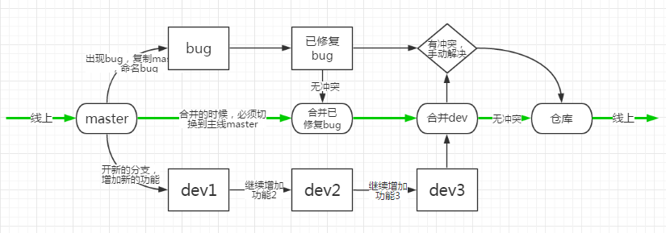

+ [GIT官网](http://git-scm.com)
+ [廖雪峰老师的GIT教程](https://www.liaoxuefeng.com/wiki/896043488029600)
+ [Git Cheat Sheet](https://gitee.com/liaoxuefeng/learn-java/raw/master/teach/git-cheatsheet.pdf)

# 1.简介
## 定义
&emsp;&emsp;Git是一个$\color{red}{开源}$的**分布式版本控制系统**，可以有效、高速地处理从很小到非常大的项目版本管理。   
    
## 功能
&emsp;&emsp;如图所示：
    ```{r img1,fig.cap='',out.width='75%',fig.align='center',echo=FALSE}
    
    knitr::include_graphics("images/git.jpg")
    ```
    
+ 从**一般开发者**的角度看，有以下功能:
   + 从服务器上克隆完整的Git仓库到单机上。
   + 在自己的机器上根据不同的开发目的，创建分支，修改代码。
   + 在单机上自己创建的分支上提交代码。
   + 在单机上合并分支。
   + 把服务器上最新版的代码fetch下来，然后跟自己的主分支合并。
   + 生成补丁（patch），把补丁发送给主开发者。
   + 看主开发者的反馈，如果主开发者发现两个一般开发者之间有冲突（他们之间可以合作解决的冲突），就会要求他们先解决冲突，然后再由其中一个人提交。如果主开发者可以自己解决，或者没有冲突，就通过。
   + 一般开发者之间可以使用pull命令解决冲突，解决完冲突之后再向主开发者提交补丁。           
   
+ 从**主开发者**的角度（假设不开发代码）看，有以下功能：
   + 查看邮件或者通过其它方式查看一般开发者的提交状态。
   + 打上补丁，解决冲突*（可以自己解决，也可以要求开发者之间解决以后再重新提交，如果是开源项目，还要决定哪些补丁有用，哪些不用）*。
   + 向公共服务器提交结果，然后通知所有开发人员。
   
## 理念
&emsp;&emsp;**任何**文件,只要有**任何**$\color{red}{改动}$,哪怕一个字节也好,都会重新创建一个副本，以牺牲磁盘空间来换取无线控制上的灵活和管理的高效。

## 优缺点比较
### 优点  
+ 适合分布式开法，有强大的分支管理
+ 公共服务器压力和数据量都不会太大 
+ 速度快、灵活 
+ 任意两个开发者之间可以很容易的解决冲突 
+ 支持不联网离线工作 
+ 向开源项目免费提供Git存储 
+ 操作简单易上手 
+ 相比集中式版本控制系统，安全性更高 

### 缺点
+ 资料少（起码中文资料很少） 
+ 学习周期相对而言比较长 
+ 不符合常规思维 
+ 代码保密性差,一旦开发者把整个库克隆下来就可以完全公开所有代码和版本信息

## 开发背景
&emsp;&emsp;[Linus](https://github.com/torvalds)在1991年创建了开源的Linux，到了2002年，代码库之大让Linus很难继续通过手工方式管理了，于是Linus选择了一个商业的版本控制系统BitKeeper，BitKeeper的东家BitMover公司出于人道主义精神，授权Linux社区免费使用这个版本控制系统。   
&emsp;&emsp;但2005年时，开发Samba的Andrew试图破解BitKeeper的协议，被BitMover公司发现了，于是要收回Linux社区的免费使用权。于是Linus花了两周的时间自己用C写了一个分布式版本控制系统，这就是Git。

# 2.操作
## 安装
&emsp;&emsp;步骤如下：
    ```{R, echo=FALSE}
DiagrammeR::grViz("
digraph RmarkDown {
graph [rankdir = TB]
node [shape=rectangle
  style=filled
  color=white
  fillcolor=white
  fontcolor=black
  arrowcolor=red
  alpha=65
  fontname = '微软雅黑']
edge [color = grey]
'安装' -> 'Linux'
'安装' -> 'Mac'
'安装' -> 'Windows'
'Linux' -> '大部分Linux'
'大部分Linux' -> '输入git命令'
'输入git命令' -> 'Linux会告知如何安装Git'
'Linux' -> 'Debian或Ubuntu Linux'
'Debian或Ubuntu Linux' -> '使用sudo apt-get install git命令'
'Debian或Ubuntu Linux' -> '稍老的版本'
'稍老的版本' -> '把命令改为sudo apt-get install git-core'
'Linux' -> '其他Linux' 
'其他Linux'->'从Git官网下载源码'
'从Git官网下载源码'->'解压'
'解压'->'依次输入：./config，make，sudo make install这几个命令'
'Mac' -> '通过homebrew安装'
'Mac' -> '从AppStore安装Xcode'
'从AppStore安装Xcode' -> '运行Xcode'
'运行Xcode' -> '选择菜单“Xcode”->“Preferences”'
'选择菜单“Xcode”->“Preferences”' -> '在弹出窗口中找到“Downloads”'
'在弹出窗口中找到“Downloads”' -> '选择“Command Line Tools”并点“Install”'
'Windows' -> 'Git官网下载安装程序'
'Git官网下载安装程序' -> '按默认选项安装'
'按默认选项安装' -> '使用git config命令设置名字和Email地址'
     }
    ", width=900)
```

## 关于版本库
### 创建版本库
&emsp;&emsp;步骤如下：
    ```{R, echo=FALSE}
DiagrammeR::grViz("
digraph RmarkDown {
graph [rankdir = TB]
node [shape=rectangle
  style=filled
  color=white
  fillcolor=orange
  fontcolor=white
  arrowcolor=red
  alpha=65
  fontname = '微软雅黑']
edge [color = grey]
'创建一个空目录' -> '用git  init把这个目录变成Git可以管理的仓库'
    }
    ", width=300)
```

$\color{red}{注意：}$使用Windows系统，需要确保目录名**不包含**中文

### 把文件添加到版本库
&emsp;&emsp;步骤如下：
    ```{R, echo=FALSE}
DiagrammeR::grViz("
digraph RmarkDown {
graph [rankdir = TB]
node [shape=rectangle
  style=filled
  color=white
  fillcolor=orange
  fontcolor=white
  arrowcolor=red
  alpha=65
  fontname = '微软雅黑']
edge [color = grey]
'把文件添加到仓库' -> '把文件提交到仓库'
    }
    ", width=140)
```

$\color{red}{注意：}$

+ 用`git add`把文件添加到仓库，且可反复多次使用，添加多个文件。
+ 用`git commit`把文件提交到仓库

## 时光机穿梭
### 查看修改
#### 掌握工作区状态
&emsp;&emsp;使用命令`git status`可以：

+ 查看有没有需要提交的修改
+ 在提交前确认将要被提交的修改

#### 查看上次具体修改的内容
&emsp;&emsp;使用命令`git diff`

#### 查看修改的历史记录
&emsp;&emsp;有两种方法：

+ 使用命令`git log`能够显示$\color{red}{从近到远}$的提交日记
+ 使用命令`git log --pretty=oneline`能够得到更$\color{red}{简洁}$的信息

### 关于版本回退
#### 版本回退
&emsp;&emsp;使用命令`git reset`  
&emsp;&emsp;$\color{grey}{例}$：`git reset --hard HEAD^`即为回退到上一个版本

$\color{red}{注意：}$  
&emsp;&emsp;git⽤`HEAD`表示当前版本，上一个版本是`HEAD^`，上上一个版本就是`HEAD^^`，往上100 个版本写成`HEAD~100`。

#### 撤回版本回退
&emsp;&emsp;使用命令`git reset --hard xxxxxxx`（xxxxxxx为原版本号的前几位）

### 管理修改
&emsp;&emsp;Git管理的是修改，而不是文件。  
&emsp;&emsp;每次修改，如果不用`git add`到暂存区，那就不会加入到`commit`中，即不会被提交。

### 撤销修改
&emsp;&emsp;$\color{grey}{场景1:}$  
&emsp;&emsp;改乱了工作区某个文件的内容，想直接丢弃工作区的修改时                
&emsp;&emsp;使用命令`git reset`让文件回到最近一次`git commit`或`git add`时的状态

&emsp;&emsp;$\color{grey}{场景2:}$  
&emsp;&emsp;改乱了工作区某个文件的内容并添加到了暂存区时，想丢弃修改   
&emsp;&emsp;使用命令`git reset HEAD file`把暂存区的修改回退到工作区

&emsp;&emsp;$\color{grey}{场景3:}$  
&emsp;&emsp;提交了不合适的修改到版本库时，想要撤销本次提交             
&emsp;&emsp;使用命令`git reset`让版本回退

### 删除文件
&emsp;&emsp;$\color{grey}{场景:}$直接在文件管理器中或者用rm命令把文件删除了，此时，工作区和版本库不一致了。若：

+ 想从版本库中彻底删除：使用命令`git reset`
+ 是误删，需要把误删的文件恢复成最新版:使用命令`git checkout -- file`

## 远程仓库
### 原理
&emsp;&emsp;找一台电脑充当服务器的角色，每天24⼩时开机，其他每个⼈都从这个“服务器”仓库克隆一份到自己的电脑上，并且各自把各自的提交推送到服务器仓库里，也从服务器仓库中拉取别⼈的提交。

### 使用前提
- [ ] 注册一个GitHub账号 
- [ ] 创建SSH Key
- [ ] 将Key添加到GitHub 

### 添加远程库
&emsp;&emsp;$\color{grey}{场景:}$  
已在本地创建了一个Git仓库，想在GitHub创建一个Git仓库，让这两个仓库进行远程同步。GitHub上的仓库既可以作为备份，又可以让其他⼈通过该仓库来协作。
&emsp;&emsp;$\color{grey}{操作步骤:}$
    ```{R, echo=FALSE}
DiagrammeR::grViz("
digraph RmarkDown {
graph [rankdir = TB]
node [shape=rectangle
  style=filled
  color=white
  fillcolor=orange
  fontcolor=white
  arrowcolor=red
  alpha=65
  fontname = '微软雅黑']
edge [color = grey]
'在GitHub创建一个新的仓库' -> '根据GitHub的提示，在本地仓库下运行命令'
'根据GitHub的提示，在本地仓库下运行命令' -> '把本地库的所有内容推送到远程库'
    }
    ", width=300)
```

$\color{red}{注意：}$使用命令`git push`把本地库的内容推送到远程库

### 从远程库克隆
&emsp;&emsp;使用命令`git clone`

## 分支管理
图示
```{r img2,fig.cap='',out.width='90%',fig.align='center',echo=FALSE}
    
    
```
  
### 创建和合并分支
+ 使用命令`git branch`查看分支
+ 使用命令`git branch <name>`创建分支
+ 使用命令`git checkout <name>`或者`git switch <name>`切换分支
+ 使用命令`git checkout -b <name>`或者`git switch -c <name>`创建+切换分支
+ 使用命令`git merge <name>`合并某分支到当前分支
+ 使用命令`git branch -d <name>`删除分支

### 解决冲突
&emsp;&emsp;当Git无法自动合并分支时，就必须$\color{grey}{首先}$解决冲突。解决冲突后，再提交，合并完成。  
&emsp;&emsp;解决冲突就是把Git合并失败的文件**手动编辑**为我们希望的内容，再提交。             
&emsp;&emsp;用`git log --graph`命令可以看到分支合并图。

### 分支管理策略
#### 团队合作分支应用原则
+ master分支应该是非常稳定的，也就是仅用来发布新版本，平时不能在上面工作。
+ 每个⼈都有自己的dev分支并在分支上工作。
+ 到新版本发布时，再把dev分支合并到master上，在master分支发布新版本。

#### 合并方式的选择
&emsp;&emsp;合并分支时，加上`--no-ff`参数就可以用普通模式合并，合并后的历史有分支，能看出来曾经做过合并，而`fast forward`合并就看不出来曾经做过合并。

### bug分支
#### 修复bug
+ 一般做法    
&emsp;&emsp;创建新的bug分支进行修复，然后合并，最后删除。

+ 当手头工作没有完成时的做法  
&emsp;&emsp;在工作现场使用`git stash`，然后去修复bug，修复后，再使用`git stash pop`，回到工作现场。

#### 将在master分支上修复的bug合并到当前dev分支
&emsp;&emsp;用`git cherry-pick <commit>`命令，把bug提交的修改“复制”到当前分支，避免重复劳动。

### feature分支
&emsp;&emsp;**开发一个新feature**，最好$\color{red}{新建}$一个分支。在新建分支上面开发，完成后合并，最后，删除该feature分支。*以避免添加新功能时，扰乱主分支。*          
&emsp;&emsp;如果要$\color{red}{丢弃}$一个没有被合并过的分支，可以通过`git branch -D <name>`强行删除。

### 多人协作
+ 查看远程库信息，使用`git remote -v`。
+ 本地新建的分支如果不推送到远程，对其他人就是不可见的。
+ 从本地推送分支，使用`git push origin branch-name`，如果推送失败，先用`git pull`抓取远程的新提交。
+ 在本地创建和远程分支对应的分支，使用`git checkout -b branch-name origin/branch-name`，本地和远程分支的名称最好一致。
+ 建立本地分支和远程分支的关联，使`用git branch --set-upstream branch-name origin/branch-name`。
+ 从远程抓取分支，使用`git pull`，**如果有冲突，要先处理冲突。**

## 标签管理
### 区别分支与标签
&emsp;&emsp;**分支**可移动，**标签**不可移动。

### 创建标签
+ 命令`git tag <tagname>`用于**新建**一个标签，默认为`HEAD`，也可以指定一个commit id。
+ 命令`git tag -a <tagname> -m "blablabla..."`可以**指定标签信息**。
+ 命令`git tag`可以**查看**所有标签。

### 操作标签
+ 命令`git push origin <tagname>`可以**推送一个本地**标签。
+ 命令`git push origin --tags`可以**推送全部未推送过的本地**标签。
+ 命令`git tag -d <tagname>`可以**删除**一个**本地**标签。
+ 命令`git push origin :refs/tags/<tagname>`可以**删除**一个**远程**标签。

## 自定义Git
&emsp;&emsp;可配置项：

+ 用户名,即`user.name`
+ 用户的email地址，即`user.email`
+ 让Git显示的颜色
+ 特殊文件的忽略——通过编写`.gitignore`文件来实现，**原则**是：
   + 忽略操作系统自动生成的文件，比如缩略图等。
   + 忽略编译生成的中间文件、可执行文件等，也就是如果一个文件是通过另一个文件自动生成的，那自动生成的文件就没必要放进版本库，比如Java编译产生的.class文件。
   + 忽略带有敏感信息的配置文件，比如存放口令的配置文件。
+ 命令的别名——通过`git config --global alias.别名 原命令全名`实现

# 3.基于git的代码托管平台
## GitHub
&emsp;&emsp;GitHub是一个**面向开源及私有软件项目**的托管平台，因为只支持Git作为**唯一**的版本库格式进行托管，故名 GitHub。         
&emsp;&emsp;除了 Git 代码仓库托管及基本的 Web 管理界面以外，还提供了**订阅、讨论组、文本渲染、在线文件编辑器、协作图谱（报表）、代码片段分享（Gist）**等功能。 

&emsp;&emsp;$\color{grey}{应用场景}$：                       

+ 基础*（与Git一样）*
   + 远程的代码存储（托管）
   + 代码版本控制
    
+ 常用
   + 多人协同开发
   + 获取、使用&学习优秀的开源项目
    
+ 额外
   + 若平时在GitHub上很活跃& 有自己的开源项目，那么这是很好的面试加分项
   + 接触优秀开发者的有效渠道
   + 搭建个人网站（博客）
   + 写作
    
## Gitee码云
&emsp;&emsp;是**中国的Github**，功能有小部分差异。  
&emsp;&emsp;主要$\color{grey}{优势}$是服务器在国内，**在国内访问速度比GitHub快很多**，可以**免费**让自己的仓库他人不可见，且免费账户同样可以建立私有项目。

## Gitlab
&emsp;&emsp;$\color{grey}{一般应用场景：}$在企业内搭建git私服。              
&emsp;&emsp;$\color{grey}{原因：}$GitLab是一款单独的软件，在Git的基础上搭建起来的Web服务。它可以创建**私有库**，解决了GitHub的免费仓库必须公开源码的问题。